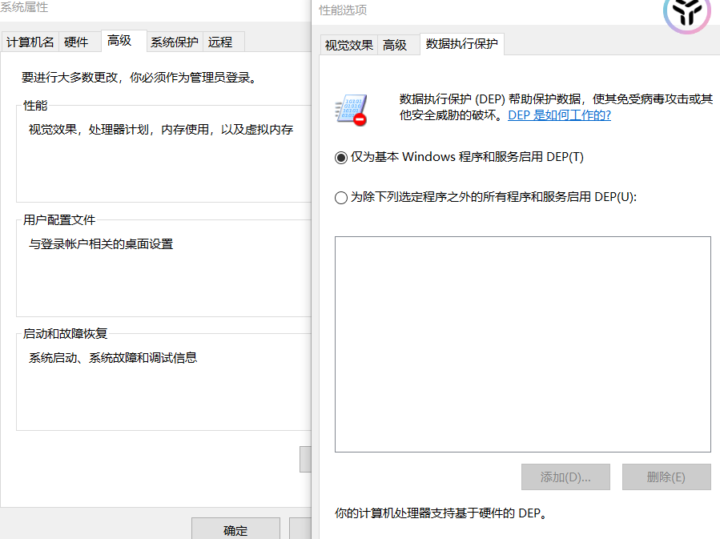
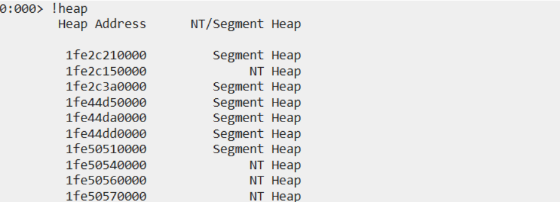
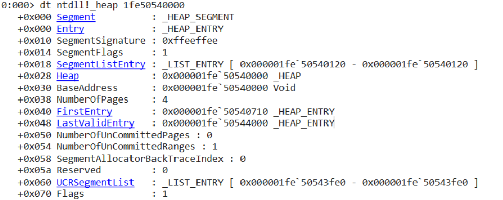

# Windows stu

从恶意软件开发/逆向工程的目的来学习关于 Windows 内部的知识。我将只涵盖那些在恶意软件开发中必要的主题。希望对红队人员有所帮助！

## 第一天

- 介绍以下内容
  - Windows API
  - OLE
  - COM
  - 进程
  - 进程状态
  - 线程
  - 线程调度

## 第二天

- 虚拟内存介绍
- 内核模式 vs 用户模式
  - 介绍
  - 术语 ring0、ring3 等的含义
  - 用户模式和内核模式下可访问的内存区域
  - 上下文切换
  - 驱动程序签名
- Windows 注册表简介

## 第三天

- 使用 Dependency Walker 查看 DLL 文件的导出函数
- 使用 WinDbg 进行内核调试（本地调试）

## 第四天

- 系统架构
- 虚拟化监视器如何帮助保护系统免受恶意内核驱动程序的攻击

## 第五天

- 解析 CreateProcess 函数

## 第六天

- 进程环境块
- 关于作业的基本信息

## 第七天

- 内存管理
  - 内存管理简介
    - 虚拟地址空间
    - 页面
    - 分页
  - 内存管理器
    - 内存相关的 Windows API
    - 共享内存和映射文件
  - 数据执行策略
    - 介绍
    - 使用 Process Explorer 查看 DEP 状态
    - DEP 状态值说明

## 第八天

- 系统内存池
  - 分页池
  - 非分页池
  - 用于在内核内存池中分配内存的 API
- 堆
  - 介绍
  - 类型
  - 使用 WinDBG 查看堆的结构


# ----1 day 概念和工具

## Windows API 的种类

### Windows API

- Windows应用程序编程接口是Windows操作系统家族的用户模式系统编程接口。
- 所有旧的API都是用C/C++编写的。
- 选择C语言是因为它足够低级，可以与操作系统服务轻松交互。

### OLE

- 对象链接和嵌入使得Microsoft Office应用程序能够在文档之间通信和交换数据（例如将Excel图表插入到Microsoft文档中）。
- OLE基于DDE（动态数据交换），这是一种较旧的数据交换方法。
- DDE存在一些限制和安全问题，这催生了COM。在这里阅读更多信息：https://revelate.co/blog/dynamic-data-exchange/

### 组件对象模型

- 它通过使用我们称之为Windows API的接口来帮助进行数据交换。
- 这些API可以轻松地从任何语言（如C、C++、Visual Basic等）调用。

### Windows Runtime

- Windows Runtime（WinRT）是支持通用Windows平台的技术，使开发人员能够编写适用于所有Windows设备的应用程序，包括Xbox、PC、HoloLens和手机。
- WinRT API可以轻松地从托管语言如C＃中访问，但是对于本机C++开发人员来说，使用WinRT要么需要大量复杂的COM代码，要么使用Visual C++组件扩展，也就是C++/CX。
- 在这里阅读更多信息：https://blogs.windows.com/windowsdeveloper/2016/11/28/standard-c-windows-runtime-cwinrt/

## 服务、函数和例程

### 进程

- 进程是执行程序实例时使用的一组资源的容器。
- 进程包含以下内容：
  - 虚拟空间：进程可以使用的虚拟内存空间集。
  - 可执行程序：EXE文件。
  - 打开句柄：对象的打开句柄列表，如信号量、文件等，可以被进程使用。
  - 安全上下文：基本上是一个访问令牌，可以指定进程可以访问的内容。
  - 进程ID：进程的唯一标识符。
  - 至少一个线程。

#### 进程状态

- 状态列指定进程的状态。它可以是运行中、挂起或未响应。
- 运行中（非UI）：如果进程没有用户界面，则运行中表示进程正在等待某个内核对象被触发或某个I/O操作完成。
- 运行中（UI）：如果进程具有用户界面，则表示它正在等待某个用户界面输入。
- 挂起：如果进程失去前台用户界面（或用户点击最小化选项），则进入挂起状态以节省电池/电源。
- 未响应：进程（实际上是拥有窗口的线程）可能正在忙于执行一些需要大量CPU资源的工作，或者正在等待其他完全不同的事情。

### 线程

- 线程只是进程中的一个实体。
- 一个进程可以有多个线程。
- 进程相互独立于系统中运行的其他进程，而线程相互依赖。
- 线程在进程内共享内存，而进程与其他进程不共享内存。
- 默认情况下，线程没有自己的访问令牌，但它们可以获取一个，从而允许单个线程模拟另一个进程的安全上下文，包括远程Windows系统上的进程，而不影响进程中的其他线程。
- 一个线程包含以下内容：
  - 代表处理器状态的CPU寄存器内容。
  - 两个栈，一个用于在内核级别执行，一个用于在用户模式下执行。
  - TLS：线程本地存储，由DLL、运行时库等使用。
  - 线程ID：线程的唯一标识符。
  - 在这里阅读更多关于进程和线程的内容：https://de-engineer.github.io/Processes-threads-jobs-fibers/

#### 线程调度

- 它们为开发人员提供了实现适合其应用程序特定需求的自定义调度算法的能力。
- 纤程（Fibers）和UMS是两种线程调度机制。

### 作业

- 作业的功能是将一组进程作为单元进行管理和操作。


# --- 2 day虚拟内存

- 虚拟内存是一种内存管理技术，其中将辅助存储器视为主存的一部分。虚拟内存是计算机操作系统中常用的一种技术。
- 虚拟内存使用硬件和软件来使计算机能够补偿物理内存短缺，将数据临时从随机存取内存（RAM）转移到磁盘存储器。将内存块映射到磁盘文件使计算机能够将辅助存储器视为主存。
- 如今，大多数个人计算机（PC）至少配备8 GB（千兆字节）的RAM。但有时，这对于同时运行多个程序来说是不够的。这就是虚拟内存发挥作用的地方。虚拟内存通过将最近未使用的数据交换到存储设备（例如硬盘或固态硬盘）来释放RAM。
- 虚拟内存对于提高系统性能、多任务处理和使用大型程序非常重要。然而，用户不应过度依赖虚拟内存，因为它比RAM要慢得多。如果操作系统频繁在虚拟内存和RAM之间交换数据，计算机将开始变慢，这称为抖动。
- 虚拟内存是在物理内存（也称为RAM）昂贵的时代开发的。计算机的RAM是有限的，因此当多个程序同时运行时，内存最终会耗尽。使用虚拟内存的系统使用硬盘的一个部分来模拟RAM。通过虚拟内存，系统可以加载更大或多个同时运行的程序，使每个程序都能够像拥有更多空间一样运行，而无需购买更多的RAM。

### 内核模式与用户模式

#### 介绍

- 用户应用程序代码在用户模式下运行，而操作系统代码（如系统服务和设备驱动程序）在内核模式下运行。
- 内核模式是指处理器中的一种执行模式，它允许访问所有系统内存和所有CPU指令。
- 这些特权级别或模式称为环。
- 当你在用户模式下打开一个进程时，操作系统会创建一个私有的虚拟空间，因为操作系统希望将应用程序的进程与其他进程隔离开来，这样如果一个进程崩溃，就不会影响其他进程。
  而内核模式与其他驱动程序和操作系统本身不是隔离的，因此如果内核驱动程序崩溃，整个操作系统都会崩溃。
- 

#### 环


- 内核模式在环0级别中运行，它具有访问所有内存区域和CPU的权限。
- 在正常用户上下文中运行的每个应用程序都在环3级运行。
- 操作系统使用环1与计算机的硬件进行交互。该环需要运行诸如通过摄像头在监视器上流式传输视频之类的命令。必须将必须与系统存储交互的指令（如加载或保存文件）存储在环2中。

#### 内存区域

- 内核/系统模式空间中的页面可以从系统本身访问，而不能从用户模式访问。
- 用户模式空间中的页面可以从用户模式和内核模式访问。
- 不可写的页面（只读）不能从任何模式写入。
- 此外，在支持不可执行内存保护的处理器上，Windows将页面标记为不可执行，以防止在数据区域中意外或恶意执行代码（如果启用了数据执行预防 [DEP] 功能）。
- Windows对于内核模式运行的组件使用的私有读/写系统内存没有提供任何保护。换句话说，一旦进入内核模式，操作系统和设备驱动程序代码就可以完全访问系统空间内存，并且可以绕过Windows安全性来访问对象。
- 这种缺乏保护也强调了在加载第三方设备驱动程序时保持警惕的必要性，特别是如果它没有经过签名，因为一旦进入内核模式，驱动程序就可以完全访问所有操作系统数据。

#### 驱动程序签名

- 如果有人在内核模式下加载了恶意驱动程序，那么攻击者将可以访问所有内存区域和CPU，这在安全角度来看是不好的。
- 考虑到安全性，微软引入了一种解决方案，即对驱动程序进行合法机构的签名。
- 对于Windows 10，所有的内核驱动程序必须由两个受承认的认证机构使用SHA1扩展验证（EV）硬件证书进行签名，一旦驱动程序签名完成，必须通过系统设备（SysDev）门户提交给微软进行认证签名。此步骤确保驱动程序从微软获得另一个签名。
- 除了上述的EV要求外，仅仅进行认证签名是不够的。要想在服务器系统上加载Windows 10驱动程序，它必须通过严格的Windows硬件质量实验室（WHQL）认证，作为硬件兼容性套件（HCK）的一部分进行正式评估，然后才能将驱动程序加载到内核模式中。
- 这是微软保护操作系统免受恶意驱动程序的方式。

#### 上下文切换

- 当用户级应用程序想要执行只有在内核模式下才能进行的操作，例如访问硬件、修改系统设置时，它会通过系统调用（syscalls）切换到内核模式，以便执行此类操作。
- 用户模式到内核模式之间的这种切换称为上下文切换。
- 模式切换可能是耗时和资源密集型的，并可能影响系统性能。
- 现代操作系统使用各种技术来最小化模式切换，例如在用户模式中缓存内核模式数据，并使用硬件支持进行虚拟化和上下文切换。
- 深入了解请参阅：https://www.geeksforgeeks.org/user-mode-and-kernel-mode-switching/

### Windows注册表

- Windows注册表是一个包含启动和配置系统所需信息的数据库，包括控制Windows操作的系统级软件设置、安全数据库和用户设置和配置。
- 它还包含有关当前硬件设置、加载的设备驱动程序、设备驱动程序正在使用的资源等的信息。
- 注册表键是充当文件夹的容器，其中包含值或子键。
- 注册表的主要分支被称为注册表hive。大多数PC都有五个注册表hive。注册表中的所有文件夹都称为键，除了这五个注册表hive：
  - HKEY_CLASSES_ROOT
  - HKEY_CURRENT_USER
  - HKEY_LOCAL_MACHINE
  - HKEY_USERS
  - HKEY_CURRENT_CONFIG
- 在这些注册表hive中，还有称为键的更多文件夹。键包含值，这些值就是设置本身。
- 参考链接：https://www.avast.com/c-windows-registry


# ---- 3 day深入了解Windows内部

  ### 查看导出函数

  - 要查看DLL中的导出函数，可以使用Dependency Walker工具 [http://www.dependencywalker.com](http://www.dependencywalker.com/)
  - 只需打开工具，点击打开文件，然后从C:\windows\System32选择kernel32.dll
  - 

  ### 内核调试

  - 内核调试是指检查内核内部数据结构或逐步执行内核中的函数
  - 进行内核调试需要一组特定的文件，称为符号文件。
  - 当应用程序、库、驱动程序或操作系统被链接时，创建.exe和.dll文件的链接器还会创建一些额外的文件，称为符号文件。
  - 符号文件包含了许多在运行二进制文件时实际上不需要的数据，但在调试过程中非常有用。
  - 符号文件包含函数和变量的名称，以及数据结构的布局和格式。它们由链接器生成，并由调试器在调试会话中引用和显示这些名称。在这里阅读有关符号文件的更多信息https://learn.microsoft.com/en-us/windows-hardware/drivers/debugger/symbols-and-symbol-files
  - 要使用任何内核调试工具来检查内部Windows内核数据结构（如进程列表、线程块、加载的驱动程序列表、内存使用信息等），我们必须拥有至少内核映像Ntoskrnl.exe的正确符号文件。
  - 现在，我们将使用Windbg来了解内核调试的基础知识
  - 由于我们将在本地机器上进行调试，因此我们只能对内核进行读取访问，因为我们无法在运行Windbg的机器上设置断点。
  - 您可以从这里下载Windbg https://learn.microsoft.com/en-us/windows-hardware/drivers/debugger/
  - 让我们检查我们自己的内核

  ### Windbg的使用方法

  ```
bcdedit /debug on
bcdedit  /dbgsettings local
  ```

  重启计算机，允许调试内核

  

  - 使用命令`!process`获取所有进程的详细信息

  - 

  - 查看内核中的所有函数（点击nt -> functions）

    

  - 查看内核中的所有模块（您可以观察到内核的核心模块"Ntoskrnl"）

    

    

  - 显示内存（字节和ASCII文本）

    

  - 查看Ntoskrnl内核映像中的函数

  - 

  - 查看反汇编函数（几个字节）

  - 

  ### 参考资料

  https://samsclass.info/126/proj/PMA410d.htm
  https://www.youtube.com/watch?v=V75-TF8QOUI


# ---- 4 day系统架构

### 架构概述


我们首先尝试对上述架构进行一个非常高级的概述，从上图中给出的四种用户模式进程开始。

- 用户进程：这些可以是以下类型，Windows 32位和64位，Windows 3.1 16位，MS-DOS 16位或POSIX 32位或64位。请注意，16位应用程序只能在32位Windows上运行，并且自Windows 8起不再支持POSIX应用程序。
- 服务进程：这些是托管Windows服务（如任务计划程序、打印机池等服务）的进程。服务通常具有独立于用户登录的要求。
- 系统进程：由登录和会话管理器等启动的进程，不由服务控制管理器启动。
- 环境子系统服务器进程：我们将在接下来的几天中了解这个。

内核模式组件包括以下内容：

- 执行体（Executive）：它帮助管理基本操作系统服务，如内存管理、进程和线程管理、网络、安全、I/O和进程间通信。
- Windows内核：它包含低级操作系统功能，如线程调度、中断和异常处理以及多处理器同步。
- 设备驱动程序：包括硬件和非硬件驱动程序。
- 硬件抽象层（Hardware Abstraction Layer，HAL）：这是一层代码，将内核、设备驱动程序和Windows执行体与特定平台的硬件差异隔离开来。
- Hypervisor层：Hypervisor本身。

#### Hypervisor

- 所有现代解决方案都使用了Hypervisor，它是一种专门的、具有高度特权的组件，允许对机器上的所有资源进行虚拟化和隔离，包括从虚拟到物理内存、设备中断，甚至PCI和USB设备。

- Hypervisor对操作系统的访问权限超过内核本身。

- 它可以保护和监视单个主机实例，提供超越内核提供的保证和保证。

- 在Windows 10中，微软现在利用Hyper-V Hypervisor提供一组名为基于虚拟化的安全（Virtualization-based Security，VBS）的新服务：

  - 设备保护（Device Guard）
  - 超级保护（Hyper Guard）
  - 凭据保护（Credential Guard）
  - 应用程序保护（Application Guard）

- 所有这些技术的重要优势是，与以前基于内核的安全改进不同，它们不容易受到恶意或编写不良的驱动程序的攻击，无论这些驱动程序是否经过签名。

- 这使得它们对当今的高级对手高度强大。这是由于Hypervisor实现了虚拟信任级别（Virtual Trust Levels，VTLs）。

- 因为普通操作系统及其组件处于较低特权模式（VTL 0），而这些VBS技术在较高特权的VTL 1下运行，即使内核模式下有一些恶意代码运行，它们也不会受到影响。

  

- 普通用户与内核之间的规则仍然适用，但现在还加上了VTL的考虑。换句话说，运行在VTL 0的内核模式代码不能触及运行在VTL 1的用户模式，因为VTL 1更具特权。然而，运行在VTL 1的用户模式代码也不能触及运行在VTL 0的内核模式，因为用户模式（Ring 3）无法触及内核模式（Ring 0）。

#### 环境子系统和子系统DLL

- 环境子系统的角色是向应用程序暴露一些基本的Windows执行系统服务的子集。每个子系统可以提供对Windows中不同子集的本机服务的访问。
- 每个可执行文件（.exe）只绑定到一个子系统。


# ---- 5 day进程和作业

### 创建进程

- CreateProcess 是Windows API提供的函数之一，用于创建进程。

- 如果调用了上述函数，则会调用一个内部函数 CreateProcessInternal，该函数会调用内核模式下的 ntdll.dll 中的 NtCreateUserProcess 函数，继续进程创建的内核模式部分。

  

### CreateProcess 函数解释


```
BOOL CreateProcessA(
  [in, optional]      LPCSTR                lpApplicationName,
  [in, out, optional] LPSTR                 lpCommandLine,
  [in, optional]      LPSECURITY_ATTRIBUTES lpProcessAttributes,
  [in, optional]      LPSECURITY_ATTRIBUTES lpThreadAttributes,
  [in]                BOOL                  bInheritHandles,
  [in]                DWORD                 dwCreationFlags,
  [in, optional]      LPVOID                lpEnvironment,
  [in, optional]      LPCSTR                lpCurrentDirectory,
  [in]                LPSTARTUPINFOA        lpStartupInfo,
  [out]               LPPROCESS_INFORMATION lpProcessInformation
);
```

- 如上所示，调用 CreateProcess 函数时需要提供几个参数，让我们逐个了解：
  - lpApplicationName：要执行的应用程序（exe、dll）的名称。
  - lpCommandLine：要与应用程序一起使用的任何可选命令行参数。
  - lpProcessAttributes：指向 SECURITY_ATTRIBUTES 结构的指针，确定新创建的进程是否可以继承。对于此参数，我通常使用 NULL。
  - lpThreadAttributes：指向 SECURITY_ATTRIBUTES 结构的指针，确定新创建的线程对象是否可以继承。
  - bInheritHandles：如果此参数为 TRUE，则调用进程中的每个可继承句柄都会被新进程继承。
  - dwCreationFlags：进程创建标志，请参考此处：[Process Creation Flags](https://learn.microsoft.com/en-us/windows/win32/procthread/process-creation-flags)
  - lpEnvironment：指向新进程的环境块的指针。如果此参数为 NULL，则新进程使用调用进程的环境。
  - lpStartupInfo：指向 STARTUPINFOEX 结构的指针。
  - lpProcessInformation：指向 PROCESS_INFORMATION 结构的指针，用于接收有关新进程的标识信息。
- 如果您对上述使用的未知数据类型感到疑问，请参考此处：[Windows Data Types](https://learn.microsoft.com/en-us/windows/win32/winprog/windows-data-types)


# ---- 6 day 进程和作业

### 进程环境块

- PEB（进程环境块）是一个结构，它存储着有关当前进程的数据，其中的字段值本身可能是结构，用于存储更多的数据。
- 它包含了关于“正在运行”进程的信息，如进程名称、PID和已加载的模块。
- 此外，我们可以从用户模式访问 PEB 结构。
- 让我们来看看 PEB 结构：

```
typedef struct _PEB {
  BYTE                          Reserved1[2];
  BYTE                          BeingDebugged;
  BYTE                          Reserved2[1];
  PVOID                         Reserved3[2];
  PPEB_LDR_DATA                 Ldr;
  PRTL_USER_PROCESS_PARAMETERS  ProcessParameters;
  PVOID                         Reserved4[3];
  PVOID                         AtlThunkSListPtr;
  PVOID                         Reserved5;
  ULONG                         Reserved6;
  PVOID                         Reserved7;
  ULONG                         Reserved8;
  ULONG                         AtlThunkSListPtr32;
  PVOID                         Reserved9[45];
  BYTE                          Reserved10[96];
  PPS_POST_PROCESS_INIT_ROUTINE PostProcessInitRoutine;
  BYTE                          Reserved11[128];
  PVOID                         Reserved12[1];
  ULONG                         SessionId;
} PEB, *PPEB;
```

PEB 结构包含以下元素：

1. Reserved1[2]：保留给操作系统内部使用。
2. Reserved3[2]：保留给操作系统内部使用。
3. Ldr：指向 PEB_LDR_DATA 结构的指针，该结构包含有关进程加载的模块的信息。
4. ProcessParameters：指向 RTL_USER_PROCESS_PARAMETERS 结构的指针，其中包含进程参数信息，如命令行。
5. 其他所有元素都仅用于内部目的。参考链接：https://learn.microsoft.com/en-us/windows/win32/api/winternl/ns-winternl-peb

### 图像加载器(Image Loader)

- 加载器是一种负责将程序和库加载到内存中，并链接所有必要的依赖项以运行应用程序的程序类型。
- 当系统上启动一个进程时，内核会创建一个进程对象来表示它，并执行各种与内核相关的初始化任务，这些任务由图像加载器执行。
- 图像加载器位于用户模式系统 DLL Ntdll.dll 中，而不是内核库中。因此，它的行为就像是 DLL 的一部分标准代码，它受到内存访问和安全权限方面的相同限制。
- 图像加载器始终存在于运行的进程中。

## 作业(Jobs)

- 作业的功能是控制一个或多个进程，称为进程组。
- 作业对象的基本功能是允许以组的形式管理和操作进程。
- 使用 `CreateJobObject` API 创建作业对象。


# ---- 7 day 内存管理

## 内存管理介绍

- 操作系统中的内存管理是控制或维护主内存，并在执行过程中将进程从主内存转移到磁盘的过程。
- 它还帮助跟踪所有内存位置，无论进程是否使用它们。
- 它跟踪内存何时被释放或共享，并相应地更改状态。
- 所有与内存管理相关的事务由内存管理器完成，如管理虚拟地址空间、分页等。

## 虚拟地址空间

- 进程的虚拟地址空间是它可以使用的虚拟内存地址集合。每个进程的地址空间是私有的，其他进程无法访问，除非进行共享。
- 虚拟地址不代表内存中对象的实际物理位置；相反，系统为每个进程维护一个页表，这是一种将虚拟地址转换为相应物理地址的内部数据结构。
- 每次线程引用一个地址时，系统会将虚拟地址转换为物理地址。
- 在此处阅读更多信息：https://learn.microsoft.com/zh-cn/windows/win32/memory/virtual-address-space

### 页(Page)

- 内存管理以称为页的不同块来完成。这是因为硬件的内存管理单元以页面为粒度将虚拟地址转换为物理地址。
- 因此，页是硬件级别上最小的保护单元。

### 分页(Paging)

- 当活动进程请求的总内存超过实际可用的物理内存时，会导致一种称为过度承诺的情况。操作系统可能会暂时允许这种情况，预期并非所有进程将同时需要它们的最大分配内存。
  在这种情况下，分页帮助管理过度承诺的内存。当系统达到过度承诺的点，物理内存不足以容纳活动进程所需的所有数据时，操作系统采用一种技术，选择性地将内存的部分（从RAM到磁盘）移动或“分页出去”。这个过程通常被称为“换出”或“分页到磁盘”。

## 内存管理器

- 内存管理器驻留在NtOSkrnl.exe中。

- 内存管理器的任何部分都不存在于HAL中。

- 内存管理器是完全可重入的，并支持在多处理器系统上的并发执行。也就是说，它允许两个线程以不破坏彼此数据的方式获取资源。为了实现这一点，内存管理器实现了各种内部同步技术。

- Windows提供了用于内存管理的API：

  - 虚拟API：用于内存分配和释放。它包括VirtualAlloc、VirtualFree、VirtualProtect、VirtualLock等函数。
  - 堆API：提供用于小型分配（通常小于一页）的函数。它在内部使用虚拟API，但在其上添加了管理功能。它包括HeapAlloc、HeapFree、HeapCreate、HeapReAlloc等函数。
  - 本地/全局API：这些是16位Windows的遗留物，现在使用堆API实现。
  - 内存映射文件：内存映射文件包含虚拟内存中文件的内容。文件与内存空间之间的这种映射使应用程序（包括多个进程）能够通过直接读写内存来修改文件。内存映射文件函数包括CreateFileMapping、OpenFileMapping、MapViewOfFile等。

  

### 共享内存和映射文件

- Windows提供了一种在进程和操作系统之间共享内存的机制。共享内存可以定义为对多个进程可见的内存，或者存在于多个进程的虚拟地址空间中的内存。
- 例如，如果两个进程使用相同的动态链接库（DLL），将该DLL的引用代码页加载到物理内存中仅一次，并在所有映射该DLL的进程之间共享这些页是有意义的。
- 每个进程仍然会维护其私有内存区域来存储私有数据，但是DLL代码和未修改的数据页可以在不造成损害的情况下进行共享。

## 数据执行预防

- 数据执行预防（DEP）是嵌入在Windows中的一种技术，可帮助保护您免受来自不应该存在的位置启动的可执行代码。DEP通过将PC的某些内存区域标记为仅用于数据来实现这一点，不允许从这些内存区域运行可执行代码或应用程序。



- 这可以防止某些类型的恶意软件通过在数据页（如堆栈）中执行放置的代码来利用系统中的漏洞。
- DEP还可以捕获权限设置不正确的程序，这些程序未正确设置用于执行代码的页面的权限。
- 在64位Windows版本中，执行保护始终应用于所有64位进程和设备驱动程序，并且只能通过将nx BCD选项设置为AlwaysOff来禁用。
- 在64位Windows上，执行保护应用于线程堆栈（用户模式和内核模式）、未明确标记为可执行的用户模式页面、内核分页池和内核会话池。
- 在ARM系统上，DEP被设置为AlwaysOn。
- 32位进程的执行保护取决于BCD nx选项的值。
- 通过调用malloc和HeapAlloc函数进行的堆分配是不可执行的。
- DEP在系统引导时根据引导配置数据中的不可执行页面保护策略设置进行配置。
- 应用程序可以通过调用GetSystemDEPPolicy函数获取当前策略设置。根据策略设置，应用程序可以通过调用SetProcessDEPPolicy函数更改当前进程的DEP设置。
- 在此处阅读更多信息：https://learn.microsoft.com/zh-cn/windows/win32/memory/data-execution-prevention

### 查看DEP状态（使用Process Explorer）

- 转到任何进程
- 选择它，然后点击“视图”->“选择列”->“DEP状态”


### DEP状态值

- DEP（永久/permanent）：这意味着进程已启用DEP，因为它是一个“必需的Windows程序或服务”。
- DEP：这意味着进程选择了DEP。
- 无：如果该列对此进程不显示任何信息，则表示DEP已禁用。


# ---- 8 day内存管理

## 内核模式堆（系统内存池）

- 在系统初始化时，内存管理器创建了两个动态大小的内存池或堆，大多数内核模式组件使用这些堆来分配系统内存：
  - 分页池（Paged Pool）：这是系统空间中的一个虚拟内存区域，可以分页进入和离开系统。
  - 非分页池（Non Paged Pool）：与分页池不同，非分页池是必须始终保留在物理RAM中的内存。它为操作系统或设备驱动程序需要的各种关键系统对象保留，用于各种关键功能。
- 这两个内存池位于地址空间的系统部分，并映射到每个进程的虚拟地址空间中。
- 执行程序提供了从这些池中分配和释放内存的例程。有关这些例程的信息，请参阅Windows开发工具包（WDK）文档中以*ExAllocatePool*、*ExAllocatePoolWithTag*和*ExFreePool*开头的函数。

## 堆

- 堆是分配给每个程序的内存区域。与分配给堆栈的内存不同，分配给堆的内存是动态分配的。

### 堆管理器

- 用户程序调用堆管理器来分配一个任意大小的块，以存储一些动态数据。
- 堆管理器返回一个指向块的指针。程序将该块用于其目的。该块的内存专门为该用途保留。
- 堆管理器存在于两个位置：Ntdll.dll和Ntoskrnl.exe。
- 最常见的Windows堆函数有：
  - HeapCreate或HeapDestroy：创建或删除堆。在创建时可以指定初始保留和提交大小。
  - HeapAlloc：分配一个堆块。它被转发到Ntdll.dll中的RtlAllocateHeap。
  - HeapFree：释放先前使用HeapAlloc分配的块。
  - HeapReAlloc：更改现有分配的大小，增大或缩小现有块。它被转发到Ntdll.dll中的RtlReAllocateHeap。
  - HeapLock和HeapUnlock：控制堆操作的互斥。
  - HeapWalk：枚举堆中的条目和区域。

### 堆的类型

- NT堆
- Segemnt堆

### 使用WinDbg查看堆结构

将计算器进程附加到WinDbg，使用命令`!heap`。



查看NT堆的结构

